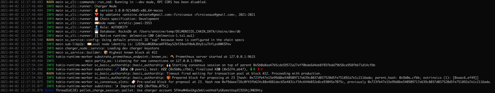
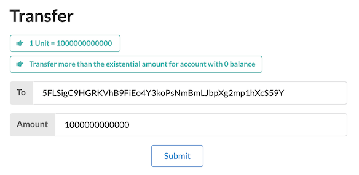
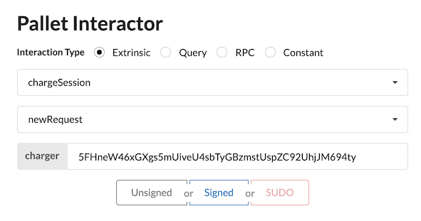
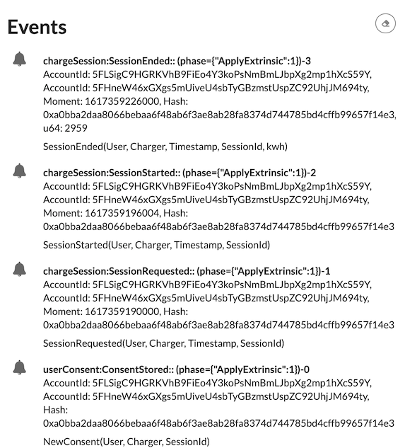
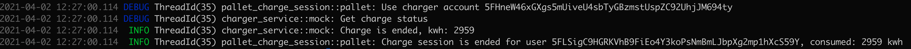

# milestone 1 : Testing Guide

This document contains a description of the implementation within the scope of milestone 1, and a guide for testing the application.

## What is included in this release?

The deliverable contains an operational substrate chain, which can be started in "development" mode.

The following 4 pallets are implemented and included in this runtime:

* **registrar:** the pallet is used to model all members of the "charger" organization, i.e. all accounts that are allowed to act as charger in the platform
* **user-consent:** this pallet is used to store and verify the consents of the users with respect to the charger. A consent is necessary for the charger to trigger a payment from an user account.
* **charge-session:** users who want to use a charger sign a transaction to this pallet, to the  `new_request` entrypoint. The pallet checks that the request is legit, and registers the request. The pallet contains an offchain worker that will communicate with the charger hardware (for the moment this is mocked) and if everything is OK, will record the beginning and the end of the charge session.
* **session-payment:** this pallet is executed from the charge-session pallet at the end of a charge session. Its responsability is to check that the consent is OK, and to make a payment from the user account to the charger. In this first version, no external call is made but the payment is recorded by the pallet.

## How to test it?

When started in development mode, the node:
- creates an organization named "Chargers" (in the registar pallet) whose owner is the **Alice** account
- registers **Bob**'s account as a member of this Chargers organization
- loads **Bob**'s private key in the node's keystore : **so Bob is a charger and can sign the transactions executed by the offchain worker**


### Build and run the chain in development mode:

```
cargo build
cargo run -- -lpallet_charge_session=debug,charger_service=debug --dev
```

Once started, we can see that Bob's account is used by the offchain worker:


### Using the **substrate-front-end-template**:

* Transfer some units to **Charlie** for transactions fees  


* With user **Charlie** selected, sign an extrinsic to pallet `chargeSession`,  method `newRequest` with **Bob**'s account as the target charger AccountId  


* In the logs of the node, the offchain worker triggers the charge:  


* After a (random) period of time, the charge session is ended and the list of events can be viewed in the frontend:  


* In the log of the node, the offchain worker as finished the session with the consumed KWH of the charge session:  
