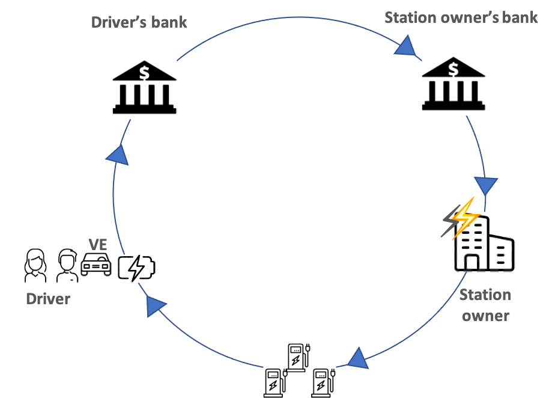
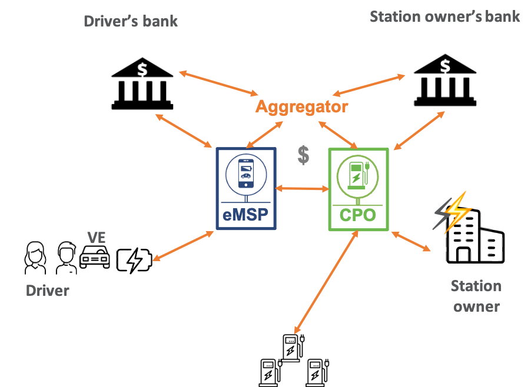
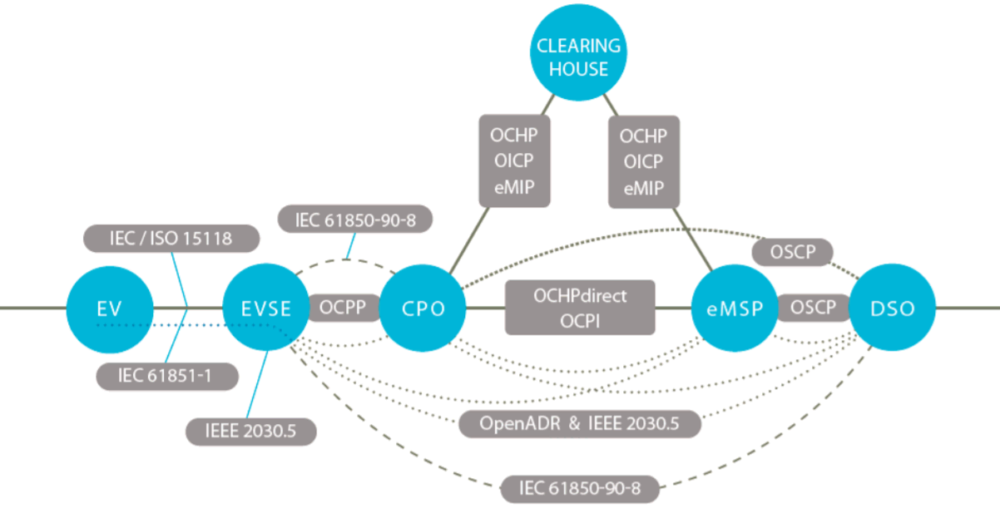
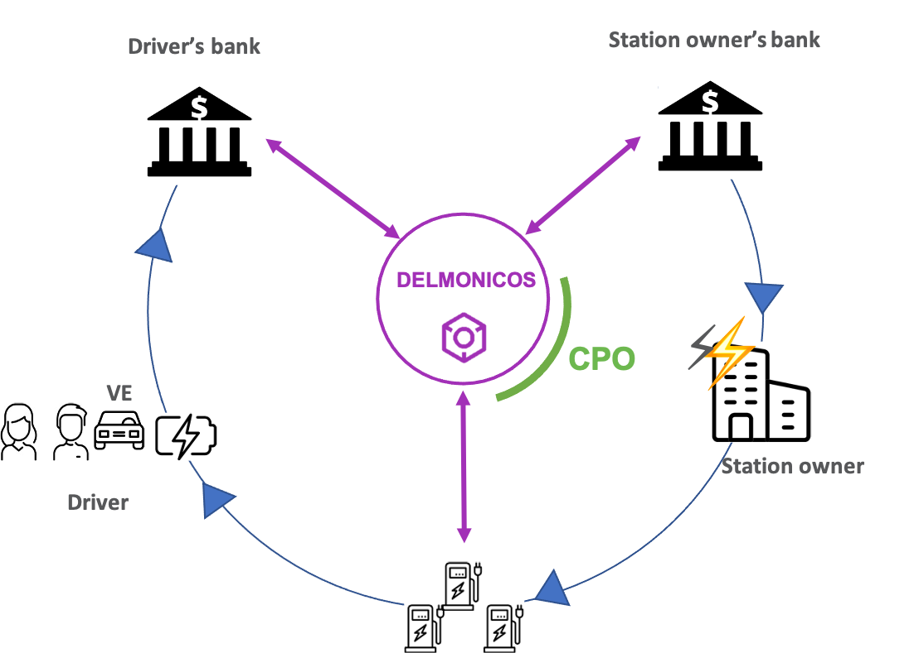
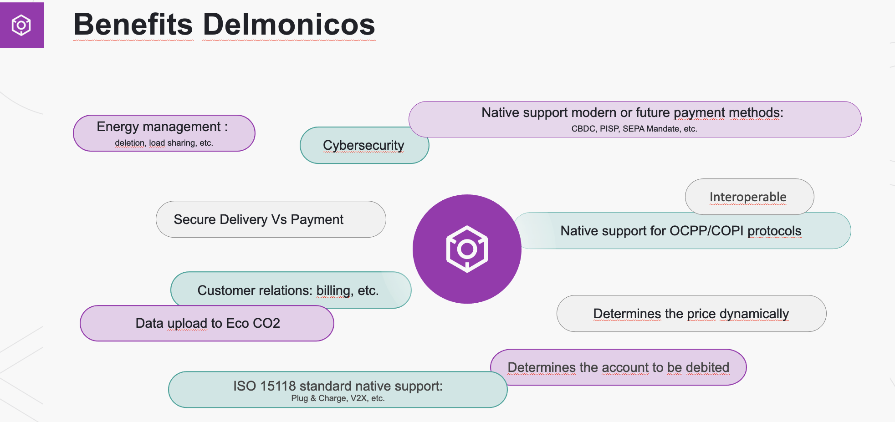

# How blockchain can ease electromobility
Electromobility is essential piece of the energy transition and sustainable city, and it is an unmissable element in transport sector evolution. Electromobility allows the synergy between ecological, social, and technical values. 
[Europe has a strong will to support][1] and help the electric car market development. Thanks to European Government actions it is now commonly accepted that [only electric vehicles will be supplied by vendors in the coming years][2].
But moving from internal combustion engine vehicles to electric vehicles is not as easy as it seems. Most people are not convinced by electromobility due to the difficulty to locate a charging station, to connect into it, due to the lack of transparency and finally due to the charging time.
Therefore, to accelerate electromobility development will [require to increase the number of public charge points and facilitate the access and connection to all of them][3]. 

At Delmonicos, we are convinced that blockchain technology can ease electromobility adoption by optimizing the charging process while enhancing security, scalability and simplifying the user experience. 

## A complex value chain carried out by a multitude of players
As shown by the following schema (Figure 1), most people think that the charging process of an electric vehicle is quite straightforward: connecting the charging station to the vehicle, starting the charging session, stopping it by unplugging the cable and then automatically paying from the Driver bank account to the charing station owner bank account.

In reality (Figure 2), it is by far more complex. Multiple players are involved during the charging session to ensure that payment is processed and completed according to the EV (electric vehicle) protocol. 

More than understanding the entire electric charging process, it is important to identify each players and explain their roles: 

* **CPO** (Charge Point Operator) manages and supervises the infrastructure of charging stations. It can operate one or many charging infrastructure on behalf of station owners or for its own account. CPO uses **CPMS** (Charge Point Managing System), the software developed by **CPMS development company** used to manage and supervise the charging stations.
* **eMSP** (eMobility Service Provider) is providing mobility services like giving access to charging stations to EV users through a RFID card of mobile App. 
* **Aggregator** (Or Clearing House or hub) is a platform offering services that enable mobility operators to easily build partnerships between CPO and eMSP to enables electric mobility roaming.

Those three players are the main ones, but there are other secondaries like **OEM Charge Points Manufacturers** who builds Charging Points, **NSP** (Navigation Service Provider) who provides location information of Charge Points, **Integrators** who supports new players who want to setup their own Charge Station, ...

Moreover, some players might have several roles like a CPO who can be also eMSP and/or develop its own CPMS.

To help all these players to communicate together, some standards have been set up to manage the electromobility ecosystem.

## A complex value chain handled by a multitude of protocols
Every distributed system has at least one protocol that define the common language, also called standard. This language is used by each stakeholder to communicate and exchange data and values. 

In the electromobility world, there are mainly 2 protocols that are defined as the standards by the market (OCPP and OCPI). But there are many other protocols that are still used.

(Image source: [ElaadNL EV related protocol study v1.1](https://www.elaad.nl/uploads/downloads/downloads_download/EV_related_protocol_study_v1.1.pdf)))

**EVSE** (Electric Vehicle Supply Equipment) means equipment that delivers electrical energy from an electricity source to charge plug-in electric vehicle batteries (Charge Point, Charging Station, Charging Dock, ...).

**DSO** (Distribution System Operator) operates the electric power distribution system which delivers energy.

### OCPP protocol
[Protocol OCPP][4] (Open Charge Point Protocol) allows the communication between **EVSE** and **CPMS**. 

This protocol exists in two major versions 1.6 and 2.0.1. The 1.6 is the most used version, the 2.0.1 will probably soon replace the 1.6 as it allows to handle more complexes CPMS and makes OCPP compatible with the ISO15118 features.

The common way to implement this protocol is to use a SecureWebSocket between the **EVSE** and the **CPMS** through a VPN (or HTTPS) for exchanging JSON messages.

### OCPI protocol
The [OCPI protocol][5] is used in two ways:
- in replacement of the private protocols used by the aggregators to exchange with CPO and with eMSP
- to exchange directly between eMSP and CPO without passing by an aggregator. It's a not very common usage of the protocol, as it's difficult to implement it for this purpose and both players must engage a contract themselves

Note: the above scheme about protocols does not take into consideration OCPI protocol used between CPO/eMSP and aggregators.

### ISO 15118 standard
Another standard is the ISO 15118 which aims to improve the electromobility communication ecosystem. Its objectives are to simplify EV drivers’ life, to allow energy optimization, to reduce costs and to strengthen (cyber) security. One part of ISO 15118 is named “Plug&Charge”, it allows the charging station to identify the user's service contract and automatically charge the vehicle only by pluging the EV to the docking station.

THE ISO 15118 standard is composed of multiple sub-documents based on the [OSI model][7] (ISO 7498).

The ISO 15118 proposes several developments points of improvements: 
- a concrete implementation of Plug & Charge
- smart charging solution allowing an intelligent management of the recharge. Using shared data connections between each tier of the charging process, smart charging allows to monitor, manage, and restricts the use of charging devices and optimizes energy consumption.  
- bidirectional charging: v2h (vehicle to home), v2b (vehicle to building), v2g (vehicle to grid). Bidirectional charging allows to re-inject battery energy into the electrical grid to participate in the optimization of consumption peaks according to production peaks.
- several more advanced scenarios requiring sophisticated equipment such as charging using induction or automated charging

[This standard is now considered unavoidable in the electromobility world][8]. However, it is not yet fully implemented, because it requires significant strategical decisions and financial risks for the players and needs a joint participation of a major part of the stakeholders who must cooperate together. Today, only a few implementation initiatives have been published, often resulting from a R&D dynamic rather than from industrialization in production.

Finally, ISO15118 proposes a security management via a PKI (Public Key Infrastructure) management architecture allowing the exchange of keys and certificates between stakeholders. This problematic requirement lies in the tree-like aspect of the certification authorities, which necessarily implies a hierarchical governance involving strategic thinking, each player wanting to be above the others, and [blocking a rapid acceptation of this kind of governance][9].

At [Delmonicos][10], we are creating a new generation of software that will make any equipped charging station natively compatible with the aforementioned standards and open to any kind of payment. Our highly modular solution would adapt to the market choices and evolutions. If the PKI architecture is the final choice, we could propose a governance fully compatible, and, should the market not accepting this valuable option, we could propose an alternative which would be compatible with the others axes of the ISO 15118.

## Delmonicos inside
To make the story short, Delmonicos wants to make the world of e-mobility easier and will allow each electric vehicle driver to be able to charge at any smart charging station without any fear or doubt about the cost they will be charged.

As seen above, the electrical ecosystem is complex, with many stakeholders and with many different vision. To handle this complexity, we develop a very modular solutions allowing an easy adaptation and facilitate our market entry.

To do this, Delmonicos aims to equip each charge point with its innovative and universal software solution "Delmonicos inside" which will be composed of an operating system and a monitoring platform. 
In addition, each user of the solution will be able:
* to proceed payment either with his usual emobility application and his payment application to which the Delmonicos API has been integrated ;
* to simply use Delmonicos web application (without any installation) ;
* to use Delmonicos mobile application allowing a deeper and customized user experience.

The final goal, when the ecosystem will be ready and the electrical vehicles able to send information to the connected Charge Point, Delmonicos will provide electric vehicle drivers an experience close to what a "Tesla" owner lives on a "Plug & Charge" Supercharger. He simply would connect his vehicle to the charging station to start charging. No identification problems or pricing surprise. Waiting for a more mature ecosystem, starting from the MVP, Delmonicos will provide a "Pay as you go" solution, allowing the process of charging without subscription using a standard payment mode (CB, Paypal, Apple Pay, ...) without any additional fee, and of course, disruptive payment solution.

Our roadmap is etablished and in our future versions, Delmonicos would deliver more features based on his modular approach (Smart charging, offline charge, and more surprises).

To achieve this challenge, Delmonicos is using Blockchain technology based on the principle of [trusted third parties][11] that will provides EV Drivers a new generation of simple and interconnected solution creating a universal network of charging station accessible, anywhere, at any time at the right price.

### Why [blockchain][19] for electromobility?  
The target is to propose a [new solution][20] being able to meet the requirement of the ecosystem being:
* identification of the ev-driver / vehicle / any element plugged on a charge point 
* authentication 
* secure payment
* governance
* 
The mandatory functionalities of solution are the following:

* It must be very **secure**. Especially, only allowed people and computers should be able to interact with charging stations. Payments must fulfill latest's security constraints especially regarding [DSP2][12].
* It must be as **competitive** as possible to operate. The challenge is to meet the security requirements without having additional costs or having to rely on external third-party.
* It must be **easy to deploy**.
* It must be **easily scalable**. Other parties should be able to join the networks without compromising the security of the infrastructure.
* It must allow stakeholders to collaborate with [**controlled transparency**, **integrity** and **effective performance**][13]

Considering the above-mentioned criteria, we have made the choice to develop our solution around blockchain technology that is perfectly matching the ecomobility requirements :

* It is secure by design and quasi-impossible to hack if carefully used and implemented.
* It allows strong authentication using wallets
* It allows secured delivery versus payment. Each payment can be related to a dedicated delivery of service and the proofs of the delivery can be stored in case of dispute.
* The trustless nature of the technology allows adding new network participants without compromising the security of other participants.
* The deployment can be easy and secured if each charging station is also a network node.
* The blockchain protocol allows several governance models.

### Why Polkadot ?
Finally, we choose [Substrate][16]/[Polkadot][15] for the following reasons:

* By having nodes with a dedicated purpose, we will be able to optimize the footprint of the node to deploy it to charging stations, or in the Cloud, that have limited available resources
* We can choose the most suitable consensus mechanism and especially [combine POA on the parachain with PoS on the relay chain][14].
* We have the flexibility to choose between multiple target topologies. E.g. one parachain for all energy providers on the platform, or one parachain by energy provider.
The composability of the [FRAME architecture][17] allows us to reuse existing pallets (e.g. identity, membership, contracts, ...) while being able to add our own specific pallets.
Since we have connections to multiple interfaces (payments, charging power, mobile apps) the offchain features of Substrate will allow us to handle the connection with external sources in both directions in a secure manner.

### REFS:
* [1]: https://ec.europa.eu/inea/en/connecting-europe-facility/ - "The Connecting Europe Facility (CEF) is a key EU funding instrument"
* [2]: https://www.consilium.europa.eu/en/policies/green-deal/eu-plan-for-a-green-transition/ - "The EU's plan for a green transition"
* [3]: https://op.europa.eu/webpub/eca/special-reports/electrical-recharging-5-2021/en/ - "report of an audit about charging station deployment"
* [4]: https://www.openchargealliance.org/ - "Main Page open charge alliance"
* [5]: https://evroaming.org/ocpi-background/ - "Main page EVRoaming Foundation about OCPI"
* [6]: https://en.wikipedia.org/wiki/ISO_15118 - "Wikipedia page about ISO 15118"
* [7]: https://en.wikipedia.org/wiki/OSI_model - "Wikipedia page about OSI Model"
* [8]: https://www.afirev.fr/en/recommendation-by-afirev-following-an-analysis-of-the-utilities-and-costs-of-iso-15118-communication-protocol-between-electric-vehicle-and-charging-point/ - "Afirev recommendations about ISO15118"
* [9]: https://www.eurelectric.org/media/4563/20200709_eurelectric_features_and_implementation_of_iso15118_final-2020-030-0464-01-e-h-330B2A5B.pdf - "Eurelectric analysis and recommendations about communication protocols via EU harmonisation measures" 
* [10]: https://www.delmonicos.tech/ - "Delmonicos.tech homepage"
* [11]: https://en.wikipedia.org/wiki/Trusted_third_party - "Wikipedia page about Trusted Third Party"
* [12]: https://ec.europa.eu/info/law/payment-services-psd-2-directive-eu-2015-2366_en - "Payment services (PSD 2) - Directive (EU) 2015/2366"
* [13]: https://www.business2community.com/strategy/transparency-essential-building-corporate-brand-trust-01125911 - "Why Transparency is Essential for Building Corporate Brand Trust"
* [14]: https://polkadot.network/PolkaDotPaper.pdf - "Polkadot: Vision for a heterrogeneous multi-chain framework"
* [15]: https://medium.com/polkadot-network/what-is-polkadot-a-brief-introduction-ca3eac9ddca5 - "What is Polkadot? A Brief Introduction"
* [16]: https://substrate.io/ - "Substrate Homepage"
* [17]: https://docs.substrate.io/v3/runtime/frame/ - "The FRAME architecture"
* [18]: https://polkadot.network/parachains/ - "What about Parachains"
* [19]: https://www.europarl.europa.eu/news/en/headlines/economy/20180514STO03406/blockchain-technology-we-aspire-to-make-eu-leading-player - "Blockchain introduction"
* [20]: https://www.youtube.com/watch?v=IiemzhwvFtg - "Decentralized Solutions for the Energy Sector"

[1]: <https://ec.europa.eu/inea/en/connecting-europe-facility/> "The Connecting Europe Facility (CEF) is a key EU funding instrument"
[2]: <https://www.consilium.europa.eu/en/policies/green-deal/eu-plan-for-a-green-transition/> "The EU's plan for a green transition"
[3]: <https://op.europa.eu/webpub/eca/special-reports/electrical-recharging-5-2021/en/> "report of an audit about charging station deployment"
[4]: <https://www.openchargealliance.org/> "Main Page open charge alliance"
[5]: <https://evroaming.org/ocpi-background/> "Main page EVRoaming Foundation about OCPI"
[6]: <https://en.wikipedia.org/wiki/ISO_15118> "Wikipedia page about ISO 15118"
[7]: <https://en.wikipedia.org/wiki/OSI_model> "Wikipedia page about OSI Model"
[8]: <https://www.afirev.fr/en/recommendation-by-afirev-following-an-analysis-of-the-utilities-and-costs-of-iso-15118-communication-protocol-between-electric-vehicle-and-charging-point/>
[9]: <https://www.eurelectric.org/media/4563/20200709_eurelectric_features_and_implementation_of_iso15118_final-2020-030-0464-01-e-h-330B2A5B.pdf> "Eurelectric analysis and recommendations about communication protocols via EU harmonisation measures" 
[10]: <https://www.delmonicos.tech/> "Delmonicos.tech homepage"
[11]: <https://en.wikipedia.org/wiki/Trusted_third_party> "Wikipedia page about Trusted Third Party"
[12]: <https://ec.europa.eu/info/law/payment-services-psd-2-directive-eu-2015-2366_en> "Payment services (PSD 2) - Directive (EU) 2015/2366"
[13]: <https://www.business2community.com/strategy/transparency-essential-building-corporate-brand-trust-01125911> "Why Transparency is Essential for Building Corporate Brand Trust"
[14]: <https://polkadot.network/PolkaDotPaper.pdf> "Polkadot: Vision for a heterrogeneous multi-chain framework"
[15]: <https://medium.com/polkadot-network/what-is-polkadot-a-brief-introduction-ca3eac9ddca5> "What is Polkadot? A Brief Introduction"
[16]: <https://substrate.io/> "Substrate Homepage"
[17]: <https://docs.substrate.io/v3/runtime/frame/> "The FRAME architecture"
[18]: <https://polkadot.network/parachains/> "What about Parachains"
[19]: <https://www.europarl.europa.eu/news/en/headlines/economy/20180514STO03406/blockchain-technology-we-aspire-to-make-eu-leading-player> "Blockchain introduction"
[20]: <https://www.youtube.com/watch?v=IiemzhwvFtg> "Decentralized Solutions for the Energy Sector"
