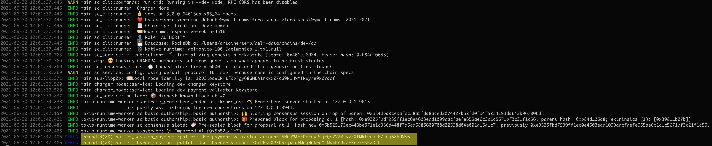
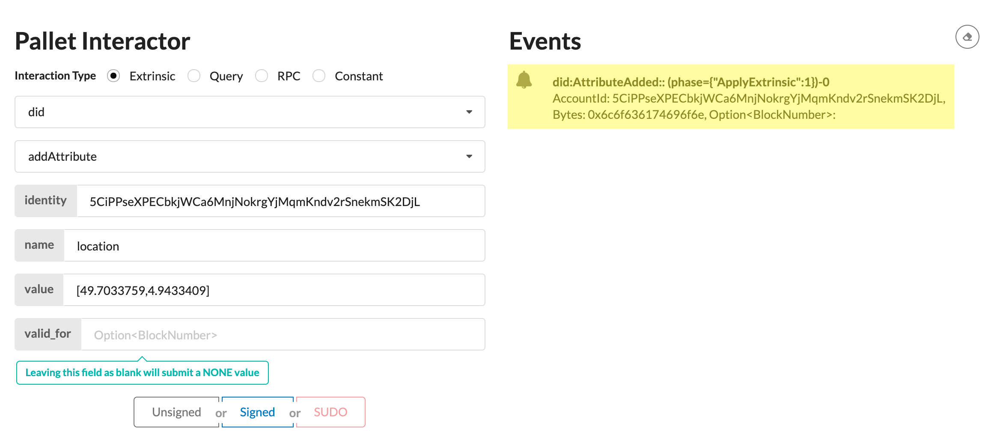
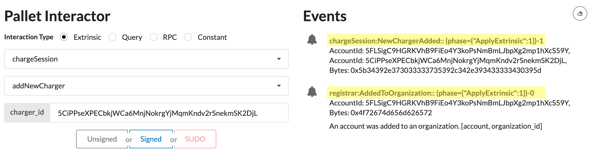
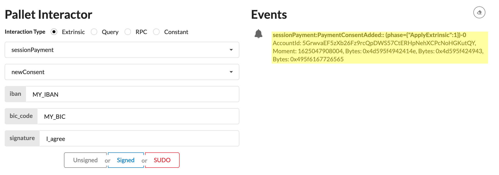
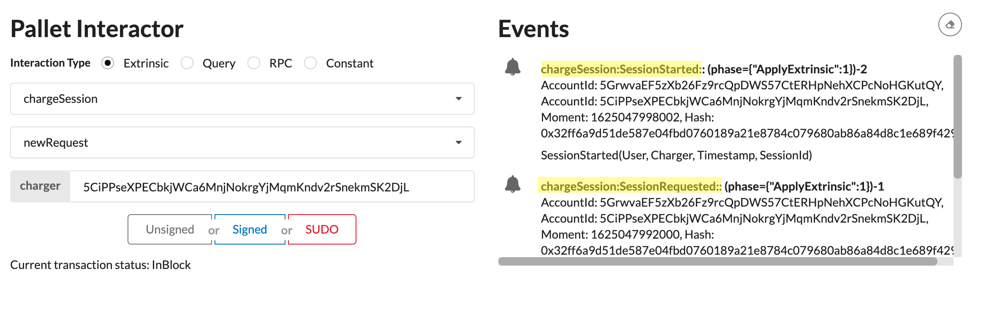
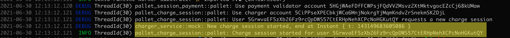
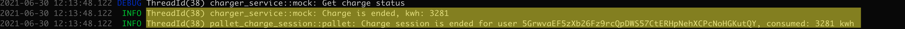
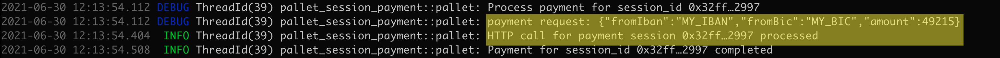
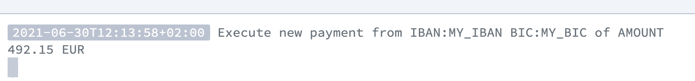
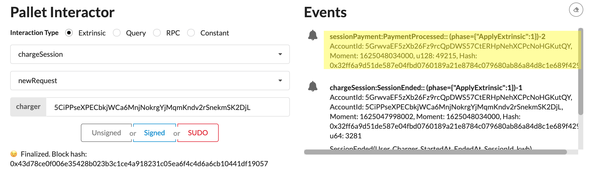

# milestone 2 : Testing Guide

This document contains a guide for testing the application in the scope of milestone 2.

## Unit tests

All unit tests specific to Delmonicos are in a dedicated `tests` module. 
So we can use the 'tests' filter to execute only Delmonicos-related unit tests:

```
cargo test 'tests'
```
## Accounts

5 accounts will be used in this scenario:

- **EV Driver** (`Alice`): the user who wants to have a charging session for his vehicle. 
- **Charger** (`Ferdie`): the account that represents the charger that will be used
- **Payment Validator** (`Eve`): the account that will be used by an offchain worker to confirm payments
- **Chargers Admin** (`Charlie`): an administration account that can authorize a new charger to join the Delmonicos network
- **Payment Validators Admin** (`Dave`): an administration account that can authorize a new Payment Process to process payments


## Genesis state

To simplify development and demonstrations, the genesis for test/dev chains are configured as follows:
- A `chargers` organization is initialized in the **registrar pallet**, the account `Charlie` is configured as owner of this organization
- A `payment_validators` organization is initialized in the **registrar pallet**, the account `Dave` is configured as owner of this organization
- Account `Eve` is addedd as member of organization `payment_validators`

## Dev node configuration

When running with the `--dev` flag, two accounts are loaded in the keystore of the substrate node:

- Account `Ferdie` with `KeyTypeId = *b"chrg"`
- Account `Eve` with `KeyTypeId = *b"paym"`

These two accounts are used by the two offchain workers (charge session duration measurement and offchain payment processing) to sign transactions.

## Build and run the chain in development mode

```
cargo build
cargo run -- -lpallet_charge_session=debug,charger_service=debug,pallet_session_payment=debug --dev
```



### Add `Ferdie` as a valid charger

First we have to add `Ferdie` account as a valid charger in the Delmonicos network.  
To be a valid charger, an account must:
- Have a "location" attribute linked to its DID
- Be a member of the "chargers" organization

First, we need to add the "location" attribute, by signing an extrinsic from account `Ferdie` to pallet `did`:



When the attribute is addedd, we have to sign an extrinsic from account `Charlie` (the **Charger Admin** account) to pallet `chargeSession` to add `Ferdie` as a member of "chargers" organization :



### Provide `Alice`'s payment information

Then, `Alice` must provide her payment information.

Sign an extrinsic from `Alice` account to pallet `sessionPayment` to register payment information:



(the `signature` data is not validated for the moment)

### Send a charge request

Finally, Alice signs an extrinsic to the `chargeSession` pallet to request a new charge from charger `Ferdie`:



The `chargeSession` offchain worker triggers the start of the vehicle charge:



After a short (random) time, the charge session is ended:



and a "Payment Requested" event is triggered.

The `sessionPayment` offchain worker executes the payment, send a request to an example REST API:



On the API side:


And finally the payment is completed in chain:

